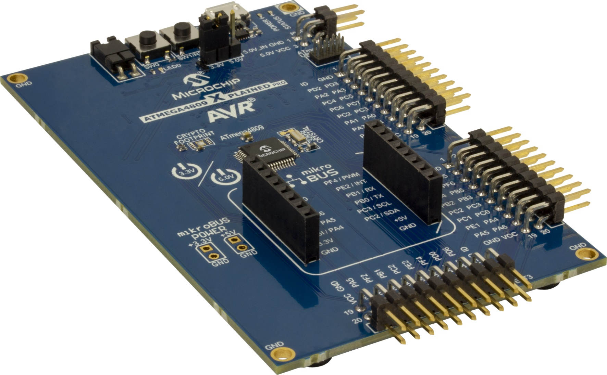
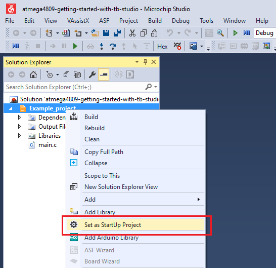
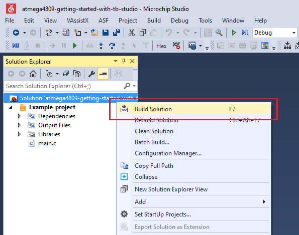
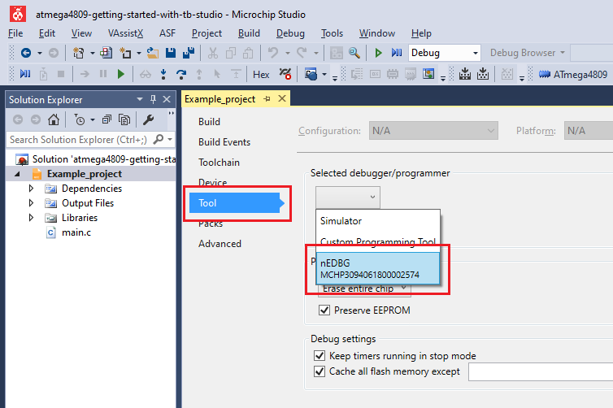
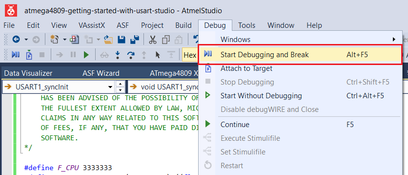
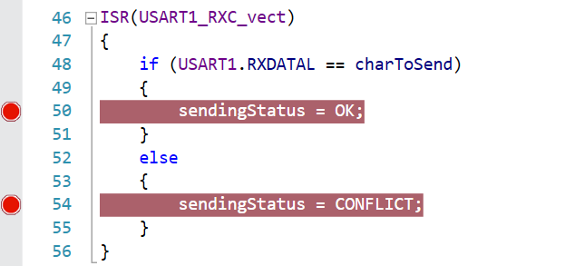
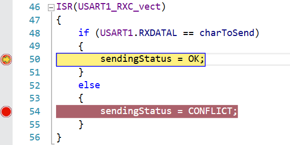
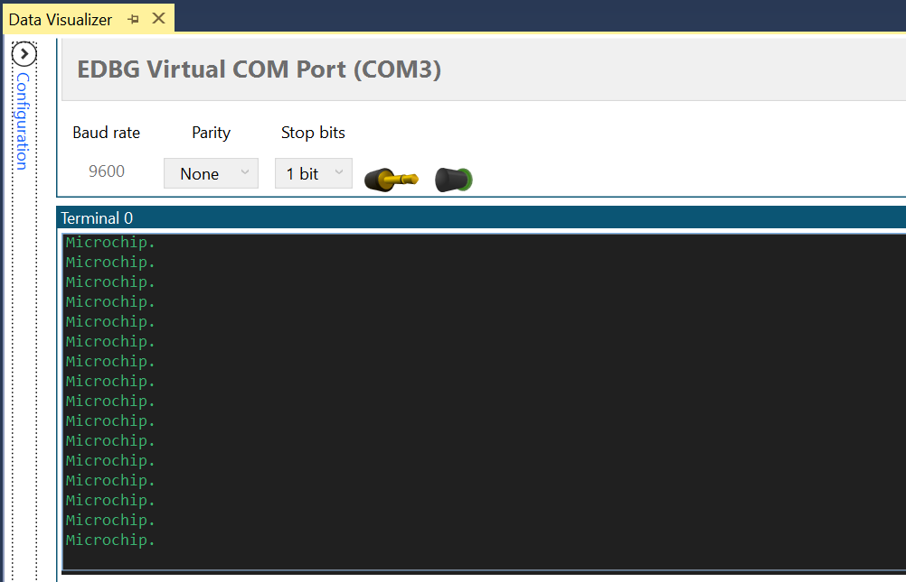

 # One Wire Mode

This program shows how to configure the Universal Synchronous and Asynchronous Receiver and Transmitter (USART) in one wire mode. In this mode the Receive (RX) and Transmit (TX) functions use the same pin and the communication becomes half duplex. All the transmitted characters loop-back to the receive buffer and can be compared to check for bus conflicts. 
The applications sends the string 'Microchip.\r\n' every 500 ms through the pin used for both RX and TX. 

## Related Documentation
More details and code examples on the ATMEGA4809 can be found at the following links:
- [TB3216 - Getting Started with Universal Synchronous and Asynchronous Receiver and Transmitter (USART)](https://ww1.microchip.com/downloads/en/Appnotes/TB3216-Getting-Started-with-USART-DS90003216.pdf)
- [ATMEGA4809 Product Page](https://www.microchip.com/wwwproducts/en/ATMEGA4809)
- [ATMEGA4809 Code Examples on GitHub](https://github.com/microchip-pic-avr-examples?q=atmega4809)
- [ATMEGA4809 Project Examples in START](https://start.atmel.com/#examples/ATMEGA4809XplainedPro)

## Software Used
- Microchip Studio 7.0.2397 or newer [(microchip.com/mplab/microchip-studio)](https://www.microchip.com/mplab/microchip-studio)
- ATmega_DFP 1.5.362 or newer Device Pack

## Hardware Used
- ATMEGA4809 Xplained Pro [(ATMEGA4809-XPRO)](https://www.microchip.com/developmenttools/ProductDetails/ATMEGA4809-XPRO)

## Setup
The ATMEGA4809 Xplained Pro Development Board is used as test platform.

 

The following configurations must be made for this project:

- System clock configured for 3.33 MHz
- Global interrupts enabled

Initialize the USART1 instance with the following configurations:
- 9600 baud rate
- 8 data bits
- no parity bit
- 1 stop bit
- Loop back mode enabled
- RX and TX enabled
- Receive Interrupt enabled

 |Pin                       | Configuration                                        |
 | :---------------------:  | :-------------------------------------------------:  |
 |            PC0           |   RX/TX - digital input (initial configuration)      |

Note: The pin PC0 is configured as output when the microcontroller transmits messages, but it is configured as input in all the other cases.

 ## Operation
 1. Connect the board to the PC.

 2. Open the **atmega4809-getting-started-with-usart-studio.atsln** solution in Microchip Studio.

 3. Set the **One_Wire_Mode** project as Start Up project. Right click on the project in the **Solution Explorer** tab and click **Set as StartUp Project**.

 

 4. Build the **One_Wire_Mode** project: right click on the **atmega4809-getting-started-with-usart-studio** solution and select Build Solution.

 

 5. Select the ATMEGA4809 Xplained Pro in the Connected Hardware Tool section of the project settings:
   - Right click on the project and click **Properties**;
   - Click on the **Tool** tab.
   - Select the ATMEGA4809 Xplained Pro (click on the **SN**) in the **Selected debugger/programmer** section, and save (CTRL + S):

 

 6. Program the project to the board. Then, click on the **Debug** tab and click Start Debugging and Break.

 

 7. Enable two breakpoints, as presented in the image below, and click Continue.

 

## Demo

When sending characters, the received one works as an acknowledgement. If the received character is the same with the sent one, the transmission is successfull.
 

This image shows the string received in a terminal software. 

 

## Summary

This project shows how to use the USART peripheral in One-Wire mode, in which both the transmitting and the receiving will be implemented using the same pin. 
