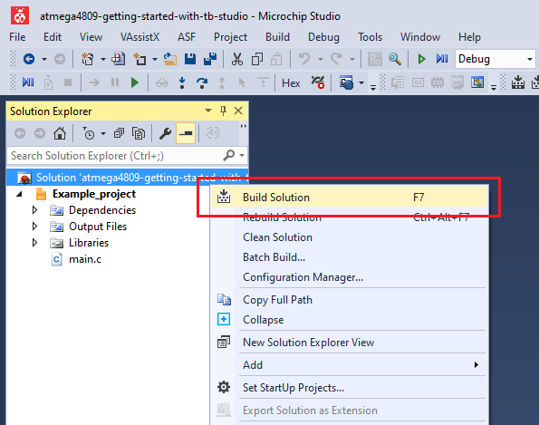
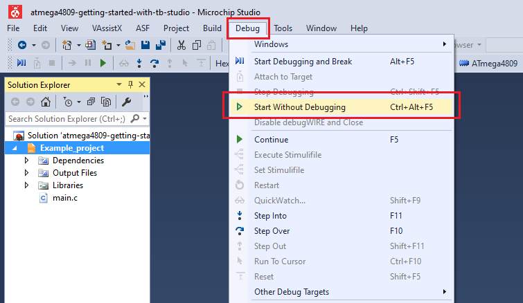
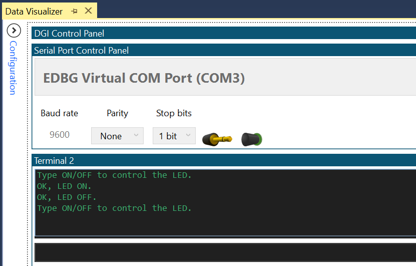

 # Receive Control Commands

This project shows how to use the Universal Synchronous and Asynchronous Receiver and Transmitter (USART) to implement a command line interface. This way, the microcontroller can receive control commands via the USART. It is convenient to use the line terminator `\r\n` as a command delimiter, so for this use case the USART will read full lines. The application can decode:
- **'ON'** command and will turn on an LED and reply with **'OK, LED ON.\r\n'**
- **'OFF'** command and will turn off an LED and reply with **'OK, LED OFF.\r\n'**
- for any other command, it will reply with **'Type ON/OFF to control the LED.\r\n'**

## Related Documentation
More details and code examples on the ATMEGA4809 can be found at the following links:
- [TB3216 - Getting Started with Universal Synchronous and Asynchronous Receiver and Transmitter (USART)](https://ww1.microchip.com/downloads/en/Appnotes/TB3216-Getting-Started-with-USART-DS90003216.pdf)
- [ATMEGA4809 Product Page](https://www.microchip.com/wwwproducts/en/ATMEGA4809)
- [ATMEGA4809 Code Examples on GitHub](https://github.com/microchip-pic-avr-examples?q=atmega4809)
- [ATMEGA4809 Project Examples in START](https://start.atmel.com/#examples/ATMEGA4809XplainedPro)

## Software Used
- Microchip Studio 7.0.2397 or newer [(microchip.com/mplab/microchip-studio)](https://www.microchip.com/mplab/microchip-studio)
- ATmega_DFP 1.5.362 or newer Device Pack

## Hardware Used
- ATMEGA4809 Xplained Pro [(ATMEGA4809-XPRO)](https://www.microchip.com/developmenttools/ProductDetails/ATMEGA4809-XPRO)

## Setup
The ATMEGA4809 Xplained Pro Development Board is used as test platform.

 

The following configurations must be made for this project:

- Clock frequency 3.33 MHz

USART0 configuration:

- 9600 baud rate
- 8 data bits
- no parity bit
- 1 stop bit
- RX and TX pins enabled (PC0 and PC1)

 |Pin                       | Configuration      |
 | :---------------------:  | :----------------: |
 |            PC0           |   Digital output   |
 |            PC1           |   Digital input    |
 |         PB5 (LED) 	    |   Digital output   |

 ## Operation
 1. Connect the board to the PC.

 2. Open the **atmega4809-getting-started-with-usart-studio.atsln** solution in Microchip Studio.

 3. Set the **Receive_Control_Commands** project as Start Up project. Right click on the project in the **Solution Explorer** tab and click **Set as StartUp Project**.

 

 4. Build the **Receive_Control_Commands** project: right click on the **atmega4809-getting-started-with-usart-studio** solution and select Build Solution.

 

 5. Select the ATMEGA4809 Xplained Pro in the Connected Hardware Tool section of the project settings:
   - Right click on the project and click **Properties**;
   - Click on the **Tool** tab.
   - Select the ATMEGA4809 Xplained Pro (click on the **SN**) in the **Selected debugger/programmer** section, and save (CTRL + S):

 

 6. Program the project to the board: click on the **Debug** tab and click Start Without Debugging.

 

## Demo

Note: open the terminal before programming the device. The help command "Type ON/OFF to control the LED." will be received. 

 

In this demo, commands are sent via serial communication and the confirm messages are received in a terminal.
 Right after initialization, the board sends the "Type ON/OFF to control the LED." message. Then, it follows the behavior described in the description of this README.

## Summary

This project shows how to use the USART peripheral to implement a command line interface.
