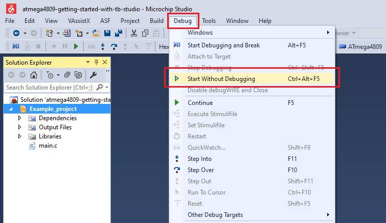
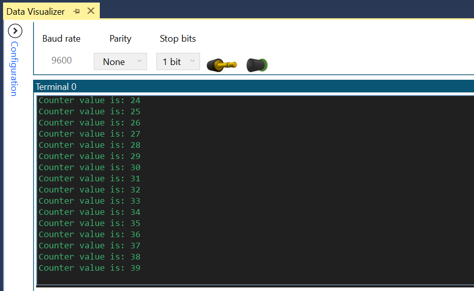

<!-- Please do not change this logo with link -->

# Send Formatted Strings Using 'printf'

This example demonstrates how to send formatted messages through the Universal Synchronous and Asynchronous Receiver and Transmitter (USART) using 'printf'. It sends the value of an 8-bit counter every 500ms, as a message and then increases the counter. 

## Related Documentation
More details and code examples on the ATMEGA4809 can be found at the following links:
- [TB3216-Getting Started with USART](https://ww1.microchip.com/downloads/en/Appnotes/TB3216-Getting-Started-with-USART-90003216B.pdf)
- [ATMEGA4809 Product Page](https://www.microchip.com/wwwproducts/en/ATMEGA4809)
- [ATMEGA4809 Code Examples on GitHub](https://github.com/microchip-pic-avr-examples?q=atmega4809)
- [ATMEGA4809 Project Examples in START](https://start.atmel.com/#examples/ATMEGA4809XplainedPro)

## Software Used
- Microchip Studio 7.0.2397 or newer [(microchip.com/mplab/microchip-studio)](https://www.microchip.com/mplab/microchip-studio)
- ATmega_DFP 1.5.362 or newer Device Pack

## Hardware Used
- ATMEGA4809 Xplained Pro [(ATMEGA4809-XPRO)](https://www.microchip.com/developmenttools/ProductDetails/ATMEGA4809-XPRO)

## Setup
The ATMEGA4809 Xplained Pro Development Board is used as test platform.

 

The following configurations must be made for this project: 

- Clock frequency set to 3.33 MHz

USART1 configuration:

- 9600 baud rate
- 8 data bits
- no parity bit
- 1 stop bit
- TX pin enabled (PC0)

 |Pin                       | Configuration      |
 | :---------------------:  | :----------------: |
 |      PC0 (USART1 TX)     |   Digital output   |

 ## Operation
 1. Connect the board to the PC.

 2. Open the **atmega4809-getting-started-with-usart-studio.atsln** solution in Microchip Studio.

 3. Set the **Send_Formatted_Strings_Using_Printf** project as Start Up project. Right click on the project in the **Solution Explorer** tab and click **Set as StartUp Project**.

 

 4. Build the **Send_Formatted_Strings_Using_Printf** project: right click on the **atmega4809-getting-started-with-usart-studio** solution and select Build Solution.

 

 5. Select the ATMEGA4809 Xplained Pro in the Connected Hardware Tool section of the project settings:
   - Right click on the project and click **Properties**;
   - Click on the **Tool** tab.
   - Select the ATMEGA4809 Xplained Pro (click on the **SN**) in the **Selected debugger/programmer** section, and save (CTRL + S):

 

 6. Program the project to the board: click on the **Debug** tab and click Start Without Debugging.

 

## Demo

 

In this demo, the value of the increasing counter is transmitted in the form of `Counter value is: <counter_value>\r\n`.

## Summary

This project shows how to use the USART peripheral to send formatted strings. 
