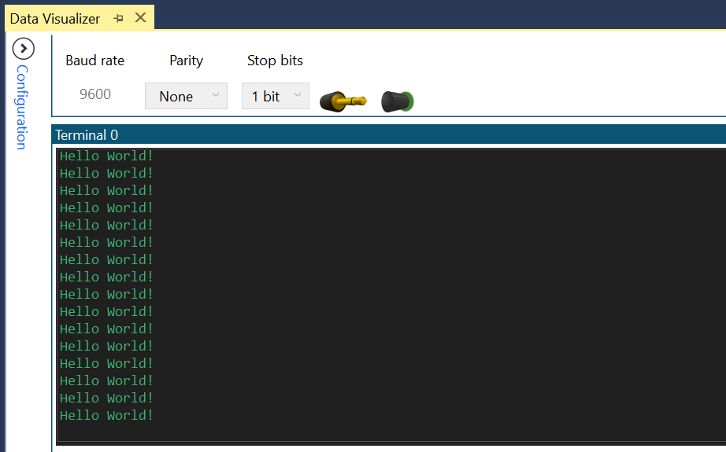

 # Send 'Hello World!'

This project shows how to send the string "Hello world!\r\n" through the Universal Synchronous and Asynchronous Receiver and Transmitter (USART) peripheral every 500ms.

## Related Documentation
More details and code examples on the ATMEGA4809 can be found at the following links:
- [TB3216 - Getting Started with Universal Synchronous and Asynchronous Receiver and Transmitter (USART)](https://ww1.microchip.com/downloads/en/Appnotes/TB3216-Getting-Started-with-USART-DS90003216.pdf)
- [ATMEGA4809 Product Page](https://www.microchip.com/wwwproducts/en/ATMEGA4809)
- [ATMEGA4809 Code Examples on GitHub](https://github.com/microchip-pic-avr-examples?q=atmega4809)
- [ATMEGA4809 Project Examples in START](https://start.atmel.com/#examples/ATMEGA4809XplainedPro)

## Software Used
- Microchip Studio 7.0.2397 or newer [(microchip.com/mplab/microchip-studio)](https://www.microchip.com/mplab/microchip-studio)
- ATmega_DFP 1.5.362 or newer Device Pack

## Hardware Used
- ATMEGA4809 Xplained Pro [(ATMEGA4809-XPRO)](https://www.microchip.com/developmenttools/ProductDetails/ATMEGA4809-XPRO)

## Setup
The ATMEGA4809 Xplained Pro Development Board is used as test platform.

 

Initialize the USART1 instance with the following configurations:
- 9600 baud rate
- 8 data bits
- no parity bit
- 1 stop bit
- TX pin enabled (PC0)

 |Pin                       | Configuration      |
 | :---------------------:  | :----------------: |
 |            PC0           |   Digital output   |

 ## Operation
 1. Connect the board to the PC.

 2. Open the **atmega4809-getting-started-with-usart-studio.atsln** solution in Microchip Studio.

 3. Set the **Send_Hello_World** project as Start Up project. Right click on the project in the **Solution Explorer** tab and click **Set as StartUp Project**.

 

 4. Build the **Send_Hello_World** project: right click on the **atmega4809-getting-started-with-usart-studio** solution and select Build Solution.

 

 5. Select the ATMEGA4809 Xplained Pro in the Connected Hardware Tool section of the project settings:
   - Right click on the project and click **Properties**;
   - Click on the **Tool** tab.
   - Select the ATMEGA4809 Xplained Pro (click on the **SN**) in the **Selected debugger/programmer** section, and save (CTRL + S):

 

 6. Program the project to the board: click on the **Debug** tab and click Start Without Debugging.

 

## Demo

 

In this demo, the 'Hello World!' message is sent via serial communication every 500ms and is visualized using the Data Visualizer tool within Microchip Studio IDE.

## Summary

This project shows how to send a string via serial communication using the USART peripheral.
