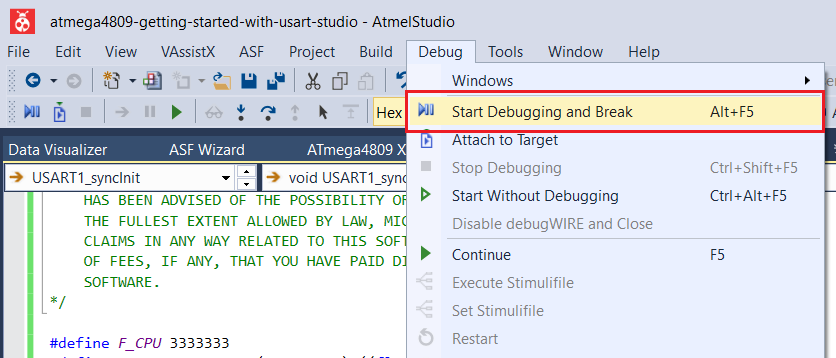
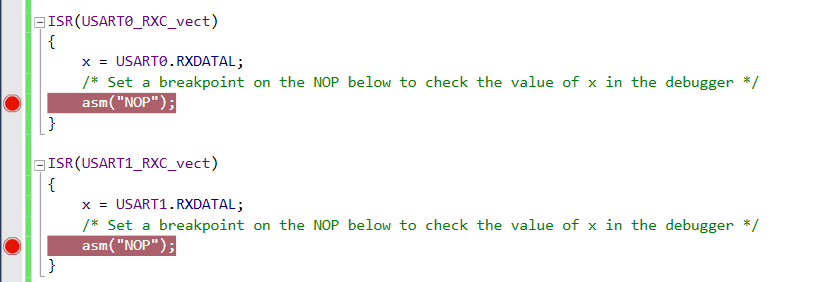
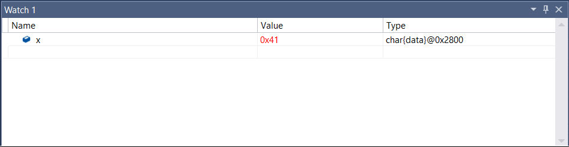

 # Synchronous Mode

This project demonstrates how to use synchronous mode for the Universal Synchronous and Asynchronous Receiver and Transmitter (USART) peripheral by connecting two instances and making them communicate with each other. In Synchronous mode, another pin, XCK is required. The instance that will be the host will provide the clock on the XCK pin and the client instance receives the clock on the XCK pin. This program sends the character 'A' from one instance and the character 'B' from the other, repeatedly.

## Related Documentation
More details and code examples on the ATMEGA4809 can be found at the following links:
- [TB3216 - Getting Started with Universal Synchronous and Asynchronous Receiver and Transmitter (USART)](https://ww1.microchip.com/downloads/en/Appnotes/TB3216-Getting-Started-with-USART-DS90003216.pdf)
- [ATMEGA4809 Product Page](https://www.microchip.com/wwwproducts/en/ATMEGA4809)
- [ATMEGA4809 Code Examples on GitHub](https://github.com/microchip-pic-avr-examples?q=atmega4809)
- [ATMEGA4809 Project Examples in START](https://start.atmel.com/#examples/ATMEGA4809XplainedPro)

## Software Used
- Microchip Studio 7.0.2397 or newer [(microchip.com/mplab/microchip-studio)](https://www.microchip.com/mplab/microchip-studio)
- ATmega_DFP 1.5.362 or newer Device Pack

## Hardware Used
- ATMEGA4809 Xplained Pro [(ATMEGA4809-XPRO)](https://www.microchip.com/developmenttools/ProductDetails/ATMEGA4809-XPRO)

## Setup
The ATMEGA4809 Xplained Pro Development Board is used as test platform.

 

The following configurations must be made for this project:

- Clock frequency 3.33 MHz
- Global interrupts enabled

USART0 and USART1 configurations:
  
- 9600 baud rate
- 8 data bits
- no parity bit
- 1 stop bit
- Synchronous mode enabled
- RX and TX pins enabled
- Receive Interrupt enabled

 |Pin                       | Configuration            |
 | :---------------------:  | :---------------------:  |
 |            PC0           |   TX1 - Digital output   |
 |            PC1           |   RX1 - Digital input    |
 |            PC2           |   XCK1 - Digital output  |
 |            PA0           |   TX0 - Digital output   |
 |            PA1           |   RX0 - Digital input    |
 |            PA2           |   XCK0 - Digital input   |

 ## Operation
 1. Connect the board to the PC. Connect the TX0 to RX1, the TX1 to RX0, and the XCK0 to XCK1.

 2. Open the **atmega4809-getting-started-with-usart-studio.atsln** solution in Microchip Studio.

 3. Set the **Synchronous_Mode** project as Start Up project. Right click on the project in the **Solution Explorer** tab and click **Set as StartUp Project**.

 

 4. Build the **Synchronous_Mode** project: right click on the **atmega4809-getting-started-with-usart-studio** solution and select Build Solution.

 

 5. Select the ATMEGA4809 Xplained Pro in the Connected Hardware Tool section of the project settings:
   - Right click on the project and click **Properties**;
   - Click on the **Tool** tab.
   - Select the ATMEGA4809 Xplained Pro (click on the **SN**) in the **Selected debugger/programmer** section, and save (CTRL + S):

 

 6. Program the project to the board. Then, click on the **Debug** tab and click Start Debugging and Break.

 

 7. Enable two breakpoints, as presented in the image below, and click **Continue**.

 

## Demo

'A' character will be transmitted by USART0 and received by USART1, and 'B' character will be transmitted by USART1 and received by USART0.
 

## Summary

This project shows how to use the USART peripheral in Synchronous mode, using a clock reference signal. 
USART0 and USART1 were configured in Synchronous mode. In the Synchronous USART mode, an additional clock pin, XCK, is used.